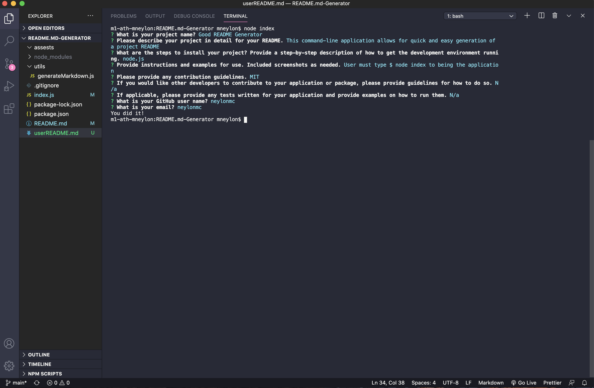
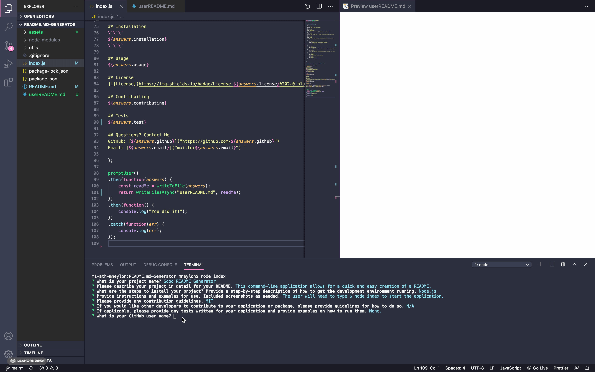

# Node.js and ES6+ Homework: Good README Generator

A quality README is important for any open source project on GitHub. This command-line application allows for quick and easy generation of a project README. This allows a user to spend more time working on finishing the project and less time creating a good, quality README. 

## Table of Contents

* [Installation](#installation)
* [Usage](#usage)
* [License](#license)
* [Contact](#contact)

## Installation
```
You will need Node.js to run this application.
```

## Usage 

The README Generator is a command-line application. To get started, this user will type node index in their command line and a series of questions will appear (as seen below). 



Once the user inputs their answers, the answers will appear in the userREADME file and be in a markdown format. 



## License
[](https://opensource.org/licenses/MIT)

## Contact

* GitHub: [neylonmc]("https://github.com/neylonmc")
* Email: [neylonmc@gmail.com]("mailto:neylonmc@gmail.com") 


